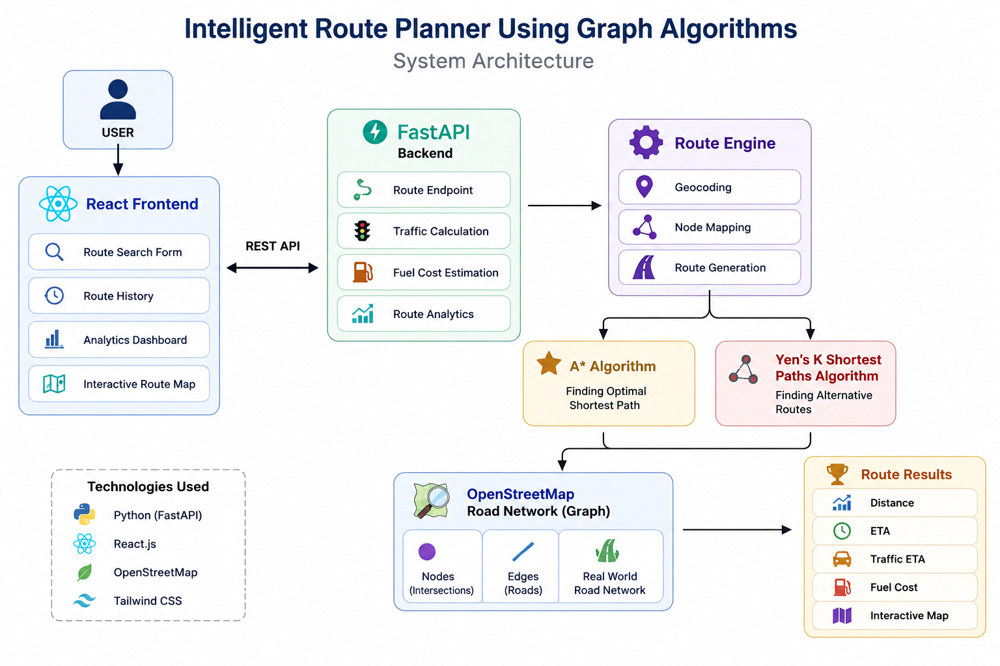
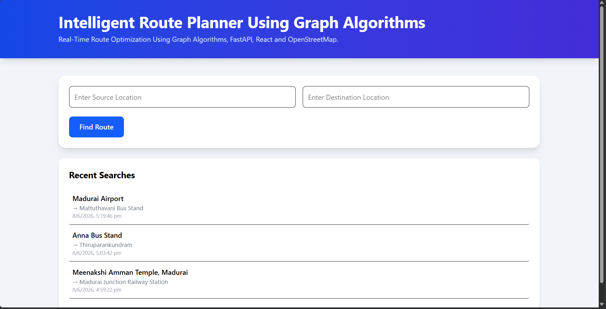
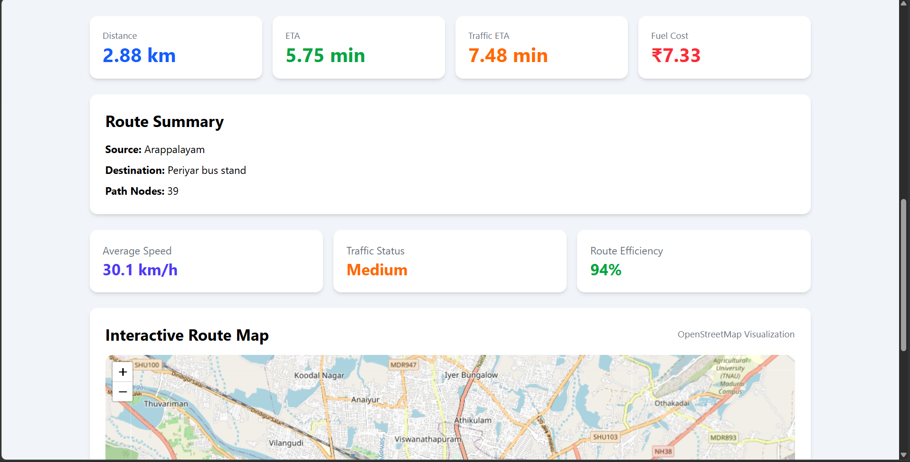
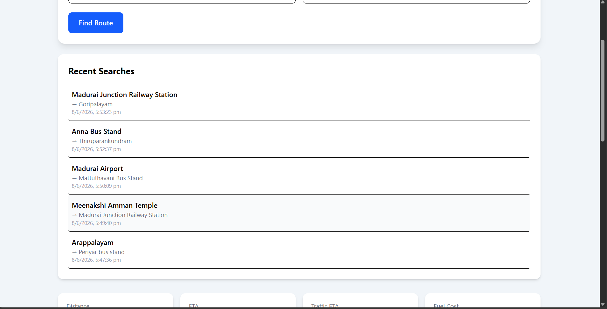
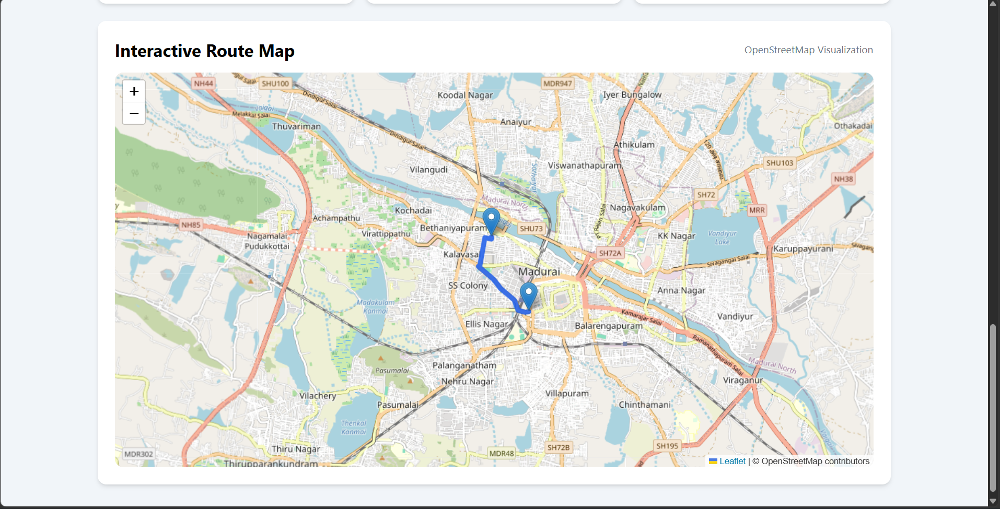
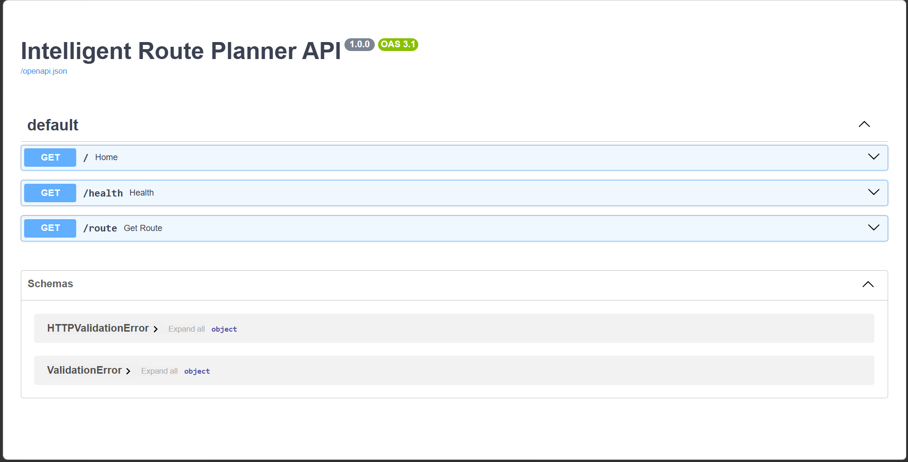

# 🚀 Intelligent Route Planner Using Graph Algorithms

<div align="center">


### Real-Time Route Optimization and Navigation System Using Graph Algorithms

</div>

---

## 🌐 Live Demo

### Frontend

```text
https://YOUR-VERCEL-URL.vercel.app
```

### Backend API

```text
https://YOUR-RENDER-URL.onrender.com
```

### Swagger Documentation

```text
https://YOUR-RENDER-URL.onrender.com/docs
```

---

## 📌 Overview

Intelligent Route Planner Using Graph Algorithms is a full-stack route optimization system that uses real-world OpenStreetMap road network data to calculate efficient travel routes between locations.

The platform combines Graph Algorithms, Geospatial Processing, FastAPI, React, and OpenStreetMap to provide:

- Shortest Path Calculation
- Traffic-Aware ETA Estimation
- Fuel Cost Prediction
- Route Analytics
- Interactive Route Visualization
- Alternative Route Exploration

---

## ✨ Features

### 🗺 Route Planning

- Real-world OpenStreetMap road network
- Source and destination search
- Interactive route visualization
- Route optimization

### ⚡ Graph Algorithms

- Dijkstra's Algorithm
- A* Search Algorithm
- Breadth First Search (BFS)
- Depth First Search (DFS)
- Yen's K-Shortest Path Algorithm

### 🚦 Traffic Analysis

- Traffic ETA simulation
- Route efficiency analysis
- Alternative route exploration

### ⛽ Fuel Cost Estimation

- Distance-based fuel calculation
- Travel expense prediction

### 📊 Route Analytics

- Total distance
- Estimated travel time
- Traffic-adjusted ETA
- Average speed
- Path node analysis

### 📜 Search History

- Recent route searches
- Local storage persistence

### 🌐 REST API

- FastAPI backend
- Swagger documentation
- JSON responses

---

## 🏗 System Architecture



---

## 📸 Screenshots

### Homepage



### Route Results



### Route History



### Interactive Route Map



### Swagger Documentation



---

## 🛠 Tech Stack

### Frontend

- React.js
- Vite
- Axios
- Tailwind CSS
- Leaflet

### Backend

- FastAPI
- Uvicorn

### Geospatial Processing

- OpenStreetMap
- OSMnx
- NetworkX
- Geopy

### Algorithms

- Dijkstra Algorithm
- A* Search
- BFS
- DFS
- Yen's Algorithm

### Languages

- Python
- JavaScript

---

## 📂 Project Structure

```text
Intelligent-Route-Planner-Using-Graph-Algorithms
│
├── api/
├── frontend/
├── src/
├── outputs/
│
├── images/
│
├── project-assets/
│   ├── architecture/
│   └── screenshots/
│
├── requirements.txt
├── README.md
├── LICENSE
└── .gitignore
```

---

## 🚀 Installation

### Clone Repository

```bash
git clone https://github.com/VaishnavaDevi-R/Intelligent-Route-Planner-Using-Graph-Algorithms.git

cd Intelligent-Route-Planner-Using-Graph-Algorithms
```

### Backend Setup

```bash
python -m venv venv

venv\Scripts\activate

pip install -r requirements.txt
```

Run Backend:

```bash
uvicorn api.app:app --reload
```

Backend:

```text
http://127.0.0.1:8000
```

Swagger:

```text
http://127.0.0.1:8000/docs
```

### Frontend Setup

```bash
cd frontend

npm install

npm run dev
```

Frontend:

```text
http://localhost:5173
```

---

## 📡 API Endpoint

### Route Calculation

```http
GET /route
```

### Example

```http
GET /route?source=Meenakshi Amman Temple, Madurai&destination=Madurai Junction Railway Station
```

### Sample Response

```json
{
  "source": "Meenakshi Amman Temple, Madurai",
  "destination": "Madurai Junction Railway Station",
  "distance_km": 1.7,
  "eta_minutes": 3.41,
  "traffic_eta_minutes": 4.43,
  "fuel_cost": 4.34,
  "path_nodes": 24
}
```

---

## 🎯 Future Enhancements

- Live Traffic API Integration
- Multi-City Support
- Voice Navigation
- AI-Based Route Prediction
- Route Sharing
- Mobile Application

---

## 👩‍💻 Author

### Vaishnava Devi

---

## ⭐ Support

If you found this project useful:

⭐ Star the repository

🍴 Fork the repository

📢 Share the project

---

## 📄 License

This project is licensed under the MIT License.

---

<div align="center">

### 🚀 Building Smarter Navigation Systems with Graph Algorithms

</div>